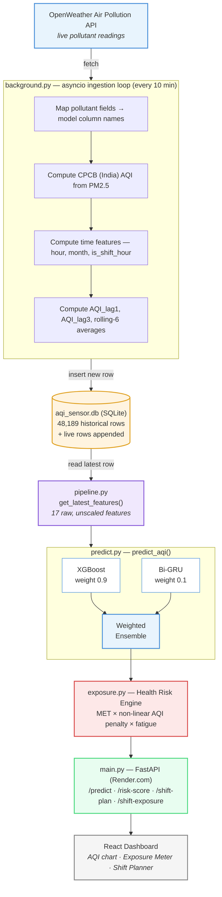

# ShiftSafe AI

**Predictive occupational health intelligence for industrial workers exposed to air pollution.**

[](https://shiftsafeai-developement.onrender.com/docs)
[](https://shiftsafeai-developement.onrender.com/openapi.json)
[]()

> Project ID 105 · IEEE CS Bangalore Chapter Internship & Mentorship Program 2026 · PES University

**Live backend:** https://shiftsafeai-developement.onrender.com/docs

---

## Table of Contents

- [What This Project Is](#what-this-project-is)
- [The Problem](#the-problem)
- [Key Novelties](#key-novelties)
- [System Architecture](#system-architecture)
- [Repository Structure](#repository-structure)
- [ML Results Summary](#ml-results-summary)
- [Backend — API Reference](#backend--api-reference)
- [Health Risk Engine](#health-risk-engine)
- [Live Data Ingestion](#live-data-ingestion)
- [Getting Started](#getting-started)
- [Team & Ownership](#team--ownership)
- [Known Issues / TODO](#known-issues--todo)
- [Roadmap](#roadmap)
- [Full Technical Documentation](#full-technical-documentation)

---

## What This Project Is

ShiftSafe AI is an end-to-end occupational health system for people who work outdoors for long stretches — construction labourers, traffic police, factory workers, and delivery riders. Instead of showing a single static AQI number the way municipal apps do, it:

1. **Forecasts** hourly Air Quality Index for Bengaluru using a hybrid ML ensemble.
2. **Converts** that forecast into a personalised cumulative exposure score based on a worker's job intensity (MET), shift duration, and fatigue over the shift.
3. **Recommends** concrete shift-scheduling changes (e.g. "do the heavy lifting at 8 AM, not 6 PM") backed by real 5.5-year pollution data.

## The Problem

- Outdoor industrial workers are exposed for 8–10 continuous hours, but AQI apps report a single instantaneous reading — not accumulated exposure.
- Physical exertion changes how much pollution a body actually absorbs. Heavy manual labour means faster, deeper breathing and proportionally more pollutant intake at the same AQI.
- No mainstream tool turns AQI into an occupational safety decision. Nothing tells a supervisor *"move the heavy lifting task to 10 AM because evening AQI is consistently worse in this city."*

## Key Novelties

| # | Novelty | Summary |
|---|---|---|
| 1 | **Hybrid ensemble forecasting** | Fuses a gradient-boosted tree model (XGBoost) with a Bidirectional GRU sequence model. The two make different categories of errors; a tuned weighted blend beats either alone. |
| 2 | **MET-based occupational exposure modelling** | Standard AQI is occupation-agnostic. ShiftSafe multiplies predicted AQI × shift duration × role-specific Metabolic Equivalent of Task (MET), so a construction worker and a factory worker experience the same ambient AQI completely differently. |
| 3 | **Transfer learning for data-scarce deployment** | Proves, via a controlled experiment, that a model pretrained on a data-rich city can be fine-tuned on as little as ~6 months of local data and still beat a model trained from scratch on that same limited sample — answering "what happens when we deploy to a city that just installed sensors?" |

## System Architecture



The dependency chain is linear: **live ingestion → model prediction → risk scoring → API → dashboard.** Each box above maps to one file in `backend/`.

## Repository Structure

```
ShiftSafeAI/
├── backend/                              ← deployed FastAPI service (Render.com)
│   ├── main.py                           ← app + all endpoints
│   ├── predict.py                        ← loads models, predict_aqi() ensemble function
│   ├── pipeline.py                       ← get_latest_features() — reads aqi_sensor.db
│   ├── exposure.py                       ← Health Risk Engine (MET, fatigue, recovery)
│   ├── background.py                     ← live OpenWeather ingestion loop (asyncio)
│   ├── db_utils.py                       ← demo/readback helpers
│   ├── aqi_sensor.db                     ← SQLite, 48,189 historical rows + live rows
│   ├── models/                           ← trained model artifacts (see below)
│   └── requirements.txt
├── FASTAPI/                               ← earlier backend iteration (superseded by backend/)
├── ShiftSafeAI_data_processing.ipynb      ← Notebook 02: cleaning + feature engineering
├── ShiftSafeAI_EDA.ipynb                  ← Notebook 02 (cont.): exploratory analysis
├── ShiftSAfeAI_xgboost_model.ipynb        ← Notebook 03: XGBoost baseline
├── ShiftSafeAI_Bi_GRU__model.ipynb        ← Notebook 04: Bi-GRU + ensemble fusion
├── ShiftSafeAI_transfer_learning.ipynb    ← Notebook 05: transfer learning experiment
├── ShiftSafeAI_handoff.ipynb              ← Notebook 06: model packaging for handoff
├── pipeline_final_verified.ipynb          ← Atharvi's verified data pipeline notebook
├── ShiftSafe_AI_ML_Documentation_Divyadarshini.docx   ← full ML technical writeup + IEEE paper draft
├── ShiftSafe_AI_Pipeline_Documentation.docx           ← full data pipeline technical writeup
└── README.md
```

**Model artifacts in `backend/models/`:**

| File | Contents |
|---|---|
| `xgboost_aqi_model.pkl` | Trained XGBoost regressor (90% ensemble weight) |
| `bigru_final.pt` | Trained Bi-GRU weights (10% ensemble weight) |
| `scaler.pkl` | `StandardScaler` fitted on the full 48,189-row dataset — required for Bi-GRU input |
| `feature_cols.json` | Exact ordered list of the 17 feature names the models expect |
| `ensemble_weights.json` | `{"xgb_weight": 0.9, "gru_weight": 0.1}` |

## ML Results Summary

Trained on 48,189 hourly Bengaluru AQI records (Jan 2015 – Jul 2020), sourced from CPCB monitoring stations via Kaggle, with a strict chronological 80/20 split to avoid look-ahead bias.

| Model | MAE | RMSE | R² |
|---|---|---|---|
| XGBoost (alone) | 3.55 | 5.05 | 0.9445 |
| Bi-GRU (alone) | 4.80 | 6.62 | 0.9046 |
| **Ensemble (XGB 0.9 / GRU 0.1)** | **3.53** | — | **0.9454** |

**Transfer learning (data-scarce deployment simulation, ~6 months / 4,380 rows):**

| Scenario | MAE | RMSE | R² |
|---|---|---|---|
| Trained from scratch | 6.88 | 8.14 | 0.4432 |
| Transfer-learned (frozen GRU, fine-tuned linear layer) | 5.13 | 7.14 | 0.5714 |

→ **+28.9% relative R² improvement** from pretraining alone, using identical data volume in both runs.

**Key EDA finding driving the whole shift-scheduling feature:** evening hours (18:00–22:00) show the highest average AQI (~97–99) in Bengaluru; morning hours (7:00–10:00) are cleanest (~86–87) — the atmospheric boundary layer collapses in the evening, trapping pollutants near ground level. Top predictive features were the engineered `AQI_lag1`, `AQI_rolling6`, and `AQI_lag3` — all three outranked every raw pollutant reading.

Full methodology, every design decision (why KNN imputation, why IQR factor 3.0 instead of 1.5, why GRU over LSTM, why bidirectional, the scaler bug encountered during transfer learning and its fix, limitations, and a ready-to-adapt IEEE paper draft) is in `ShiftSafe_AI_ML_Documentation_Divyadarshini.docx`.

## Backend — API Reference

**Base URL:** `https://shiftsafeai-developement.onrender.com`
**Interactive docs:** [`/docs`](https://shiftsafeai-developement.onrender.com/docs)

| Method | Endpoint | Purpose |
|---|---|---|
| `GET` | `/` | Service metadata |
| `GET` | `/health` | Health check + model/ensemble info |
| `POST` | `/predict` | Next-hour AQI prediction |
| `POST` | `/risk-score` | Cumulative exposure score + risk tier for a shift |
| `GET` | `/shift-plan` | Hour-by-hour AQI + recommended work intensity for an 8-hour shift |
| `GET` | `/demo/latest-readings` | Debug endpoint — most recent rows in `aqi_sensor.db`, to verify live ingestion |

### `POST /predict`

```json
// Request
{ "worker_role": "construction" }

// Response
{
  "predicted_aqi": 94.5,
  "hour": 14,
  "timestamp": "2026-07-20T14:00:00Z"
}
```

### `POST /risk-score`

```json
// Request
{ "worker_role": "construction", "shift_duration_hours": 8 }

// Response
{
  "exposure_score": 423.6,
  "risk_tier": "Moderate",
  "directive": "Elevated exposure detected. Wear dust mask. Hydrate every 30 minutes. Consider task rotation.",
  "predicted_aqi": 94.5
}
```

**Supported `worker_role` values:** `construction`, `traffic_police`, `factory`, `delivery`

### `GET /shift-plan?worker_role=construction&shift_start_hour=6`

Returns an 8-hour schedule, each hour tagged with predicted AQI, risk level, and recommended work intensity (Heavy / Moderate / Light / Rest), derived from the EDA-confirmed hourly AQI pattern.

## Health Risk Engine

`exposure.py` implements a physiologically-grounded scoring model, considerably more detailed than a flat linear formula:

```
hourly_exposure = aqi_penalty(AQI) × MET(role) × fatigue(hour_in_shift)
total_exposure  = Σ hourly_exposure × (1 − recovery_reduction)
```

- **Non-linear AQI penalty** — `(AQI / 100) ^ 1.2`. Reflects the WHO PM2.5 concentration-response curve: health damage accelerates super-linearly above AQI 100, once the respiratory system's filtration is overwhelmed.
- **Role-specific MET values** (Compendium of Physical Activities): `construction 5.0`, `traffic_police 3.0`, `factory 4.0`, `delivery 6.0`.
- **Step-based fatigue progression** — breathing rate rises 10–20% after 4 hours and up to 30% after 8 hours of sustained physical work (NIOSH, 2016); high-exertion roles (construction, delivery) fatigue faster and reach a higher ceiling than moderate roles (traffic police, factory).
- **Recovery credit for indoor breaks** — up to 40% exposure reduction, only counted if the break happens during a Moderate/High/Critical AQI hour.

**Risk tiers:**

| Tier | Score range | Directive |
|---|---|---|
| Safe | < 300 | Normal operations. Standard PPE applies. |
| Moderate | 300 – 600 | Wear dust mask. Hydrate every 30 minutes. Consider task rotation. |
| High | 600 – 1000 | Wear N95. Limit outdoor tasks to 30-minute intervals. Mandatory indoor break after every outdoor hour. |
| Critical | > 1000 | Halt all outdoor operations. Move all workers indoors. |

## Live Data Ingestion

`background.py` runs as an `asyncio` task alongside the FastAPI server (started in the `startup` event) and, every 10 minutes:

1. Fetches live Bengaluru air pollution data from the **OpenWeather Air Pollution API** (`OPENWEATHER_API_KEY` env var, set on Render — never hardcoded).
2. Maps OpenWeather's field names to the model's trained column names (`pm2_5` → `PM2.5`, etc.).
3. **Converts OpenWeather's 1–5 European AQI scale into India's 0–500 CPCB scale** by computing the CPCB sub-index directly from PM2.5 concentration using official breakpoints — this step matters because the model was trained entirely on CPCB-scale AQI.
4. Computes IST-based time features (`hour`, `month`, `day_of_week`, `is_weekend`, `is_shift_hour`) — IST is used deliberately since UTC would shift `hour` by 5.5 and corrupt predictions.
5. Computes `AQI_lag1`, `AQI_lag3`, and 6-hour rolling averages from the most recent existing rows.
6. Inserts the new row into `aqi_sensor.db`, so the next `/predict` call reflects near-real-time conditions instead of the 2020 historical tail.

If the OpenWeather call fails, the cycle is skipped gracefully and the API continues serving predictions from the last good row — the loop never dies on a transient network error.

## Getting Started

### Run the backend locally

```bash
cd backend
pip install -r requirements.txt
export OPENWEATHER_API_KEY=your_key_here   # optional — falls back to historical data without it
uvicorn main:app --reload --port 8000
```

Open `http://localhost:8000/docs` for the interactive Swagger UI.

### Requirements

```
fastapi
uvicorn[standard]
xgboost
torch
scikit-learn
pandas
numpy
pydantic
apscheduler
requests
```

### Deployment (current: Render.com)

1. Connect this repo to a Render Web Service, root directory `backend/`.
2. Build command: `pip install -r requirements.txt`
3. Start command: `uvicorn main:app --host 0.0.0.0 --port $PORT`
4. Set `OPENWEATHER_API_KEY` in the Render environment variables dashboard.

## Team & Ownership

| Workstream | Owner | Scope |
|---|---|---|
| **Machine Learning** | Divyadarshini M.B (ML Lead) | Data cleaning, feature engineering, EDA, XGBoost + Bi-GRU ensemble, transfer learning, model packaging |
| **Data Pipeline** | Atharvi Desurkar | SQLite live-sensor simulation, KNN imputation for sensor failures, `get_latest_features()` |
| **Backend (FastAPI)** | Aadish Sarin | REST API, Health Risk Engine wiring, live OpenWeather ingestion, Render.com deployment |
| **Frontend** | Marella Likhita Sri Durga | React dashboard — AQI forecast chart, Exposure Budget Meter, Shift Planner Simulator, hotspot map |

Manasi, Namitha, and Medha are collaborators on adjacent ML/CV coursework and are not part of this specific ShiftSafe AI team.

## Known Issues / TODO

- **Duplicate `/risk-score` route in `backend/main.py`.** The endpoint is defined twice. The second definition (which Python's function-overwrite semantics make the one actually served) references an undefined `IST` variable and reads `now_utc.astimezone(IST)` — this will raise a `NameError` at request time. The first, working definition never executes. Needs one definition removed and `IST` imported from `background.py` (or defined locally) if the UTC/IST timestamp fields are wanted in the response.
- The Bi-GRU's production inference currently repeats the latest feature row 24 times to build its input sequence, rather than using a genuine rolling 24-hour window from the live pipeline — a documented simplification, not a bug.
- `/shift-exposure` (the detailed per-hour breakdown endpoint with fatigue + recovery breaks) is present in `main.py` but does not yet appear on the live Render deployment's `/docs` — likely pending a redeploy.
- Transfer learning was validated via a temporal holdout on the same city, not a genuinely independent second city — documented as a methodological limitation, with real cross-city validation proposed as future work.

## Roadmap

1. Fix the `/risk-score` duplicate-route bug above.
2. Replace the repeated-row Bi-GRU sequence simplification with a genuine rolling 24-hour window sourced from the live pipeline.
3. Acquire a second city's historical dataset to re-run transfer learning as genuine cross-city validation.
4. Introduce a validation split distinct from the final test set for ensemble weight tuning.
5. Extend feature engineering with weather covariates (temperature, humidity, wind speed) — EDA suggests this could meaningfully improve O3 and PM10 prediction.
6. End-to-end latency benchmark of `predict_aqi()` under realistic API load.

## Full Technical Documentation

- `ShiftSafe_AI_ML_Documentation_Divyadarshini.docx` — complete notebook-by-notebook ML walkthrough (every design decision and why), full results tables, IEEE paper draft (Methodology/Results/Discussion), limitations, next steps.
- `ShiftSafe_AI_Pipeline_Documentation.docx` — complete data pipeline technical writeup (SQLite schema, sensor simulation, KNN imputation, APScheduler/asyncio integration).

---

*ShiftSafe AI — IEEE CS Bangalore Chapter Internship 2026 · Project ID 105 · PES University*
